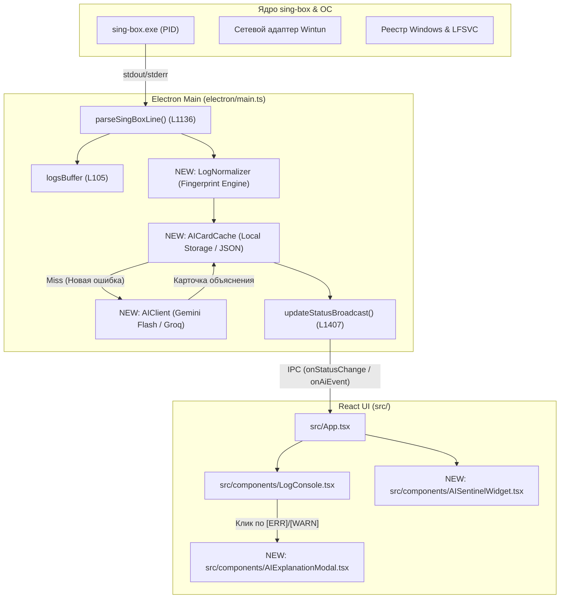
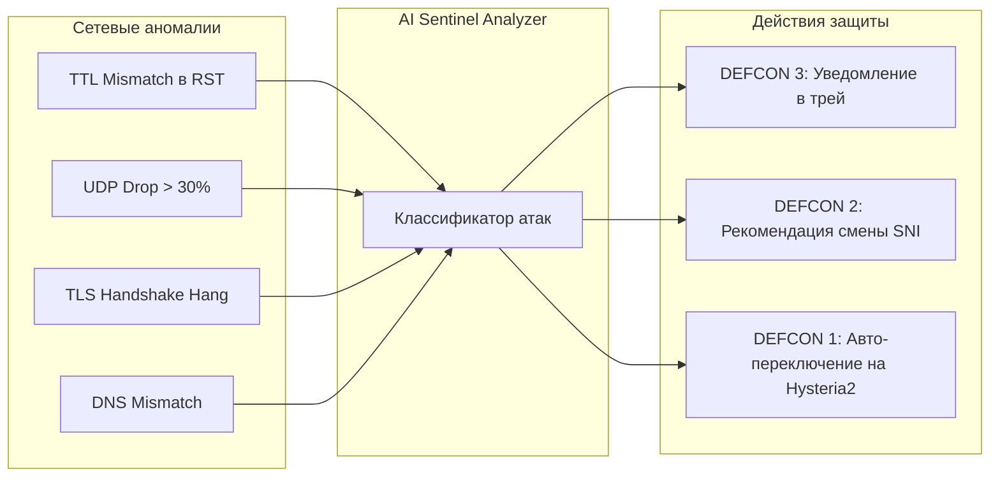

# Полная сводка диалога, концепции и план внедрения AI в Exilium Switch

> **Статус документа:** Концептуальный и технический мастер-план  
> **Проект:** [Exilium Switch](file:///e:/Code/ExiliumSwitch) (Windows Resident Shield & VPN Controller)  
> **Окружение:** Electron 34, React 18, TypeScript, Tailwind CSS, sing-box v1.11+  
> **Инструменты анализа:** CodeGraph (AST AST-Level Intelligence) + Graphify (Architecture Knowledge Graph)

---

## 1. Хронологическая сводка диалога (Message-by-Message Synthesis)

Ниже зафиксирована пошаговая эволюция идеи от первой мысли до комплексной архитектуры кибер-щита:

| Сообщение | Инициатор | Суть тезиса и обсуждения | Ключевой вывод / Решение |
| :--- | :--- | :--- | :--- |
| **№1** | **User** | Идея прикрутить ИИ для анализа трафика, логов и технической части VPN/клиента, с последующим добавлением инструментов для настроек и автономности. | Запрос на архитектурную оценку идеи. |
| **№2** | **Assistant** | Разделение зон ответственности: категорический отказ от анализа сырого трафика (задержки + приватность) в пользу **Control Plane** (диагностика логов, авто-подбор SNI/портов, починка стека). Создан артефакт `ai_integration_assessment.md`. | Идея жизнеспособна на 9/10 при трехуровневой архитектуре (L1: sing-box, L2: телеметрия, L3: ИИ). |
| **№3** | **User** | Уточнение исходного триггера: пугали строки `[ERR]` и `[WARN]` в логах. Вопрос про использование условно-бесплатных API старых/легких моделей для мониторинга. | Фокус смещен на снятие тревожности и объяснение логов простым языком. |
| **№4** | **Assistant** | Разбор природы логов sing-box (95% — штатный шум: закрытые вкладки, блокировка рекламы). Сравнение бесплатных API (Google AI Studio Gemini Flash, Groq Llama 3.1 8B, OpenRouter). Концепция локального кэширования и дебаунса. | Для задачи идеально подходят сверхбыстрые и бесплатные модели (Gemini 2.0 Flash / Llama 3.1 8B). Себестоимость = 0$. |
| **№5** | **User** | Формулирование логики: ИИ работает только при активном VPN. Разбирает строчку, объясняет, сохраняет в карточку. Повторные логи берет из памяти. В будущем — прикрутить «руки». | Закреплена стратегия: ИИ работает через защищенный туннель, исключая проблему блокировки API в РФ. |
| **№6** | **Assistant** | Введение понятия **Нормализации логов (Fingerprinting)**: замена динамических IP/портов на токены (`dial tcp <IP>:<PORT>: i/o timeout`), чтобы кэш работал с 1-го раза. Закреплен переход: «Глаза» (Объяснения) ➔ «Советчик» (Кнопка) ➔ «Руки» (Автономность). | Кэш из 15–20 карточек покрывает 99% всех сетевых ситуаций без расхода API. |
| **№7** | **User** | Расширение видения: красивый динамический мониторинг в приложении, оценивающий скорость, стабильность, проблемы под управлением ИИ. | Появление концепции **AI Sentinel Health Dashboard** (виджет здоровья соединения). |
| **№8** | **Assistant** | Разделение мониторинга: «Быстрая математика» (локальный расчет пинга, джиттера, баллов 0–100% за 1 сек) + «Когнитивный вердикт» (фраза от ИИ раз в 5–10 мин или при аномалии). | Плавный UI без задержек и без сжигания токенов. |
| **№9** | **User** | Долгосрочный вектор: анализ динамики состояния во времени, проверки на вмешательство РКН и провайдеров, раннее оповещение и боевая готовность. | Концепция **Censorship Early Warning System** (система раннего предупреждения об угрозах). |
| **№10** | **Assistant** | Матрица векторов атак РКН/ТСПУ (TCP RST инъекции, глушение UDP/Hysteria2, QoS Throttling, DNS Poisoning, утечки гео Windows) и уровни тревоги DEFCON. | Превращение клиента в персональный цифровой щит. |
| **№11** | **User** | Философия: проект строго для себя и близких (никакой коммерции). Желание пользоваться свободным интернетом и пресекать любые попытки разрушения. Режим штурма/отдыха. | Отсутствие коммерческих компромиссов: максимум надежности, режим «Zero-Friction для семьи». |
| **№12** | **Assistant** | Поддержка философии. Добавлены идеи: «Семейный режим без кнопок», канареечный список важных сервисов (YouTube 4K, Discord, Telegram, Steam), суточная сводка. | Формирование концепции «непробиваемого персонального бастиона». |
| **№13** | **User** | Откровенная позиция: «Я не глубокий IT-специалист, а визионер. Мне важно иметь идеальный, защищенный сервер, красивый клиент и стабильную связь. Поэтому я штурмовал тебя диагностиками». | Определение ролей: Пользователь — архитектор/визионер, Агент — главный инженер. |
| **№14** | **Assistant** | Валидация позиции. Сформулирован «Золотой треугольник Exilium»: Облачный сервер ➔ Канал (sing-box TUN) ➔ Клиент (Exilium Switch + AI Sentinel). Диагностика как возврат спокойствия. | Снятие стресса от логов: перевод с языка сокетов C/Go на язык понятной человеческой безопасности. |
| **№15** | **User** | Финальный запрос: составить полную сводку всех сообщений в .md файл, задействовать CodeGraph и Graphify для исследования кода и распланировать всё. | Переход к созданию данного мастер-плана. |

---

## 2. Философия и цели проекта

1. **Персональный суверенитет и цифровая свобода:**
   Exilium Switch создается не как массовый продукт для продажи, а как **персональный защитный бастион** для автора и его семьи.
2. **Нулевой порог стресса (No Anxiety UX):**
   Пользователь не должен расшифровывать ошибки Go-рантайма `sing-box`. Интерфейс транслирует абсолютную ясность: *«Все работает штатно»*, либо *«Зафиксирована попытка фильтрации, приняты защитные меры»*.
3. **Бескомпромиссная безопасность («Золотой треугольник»):**
   * **Сервер:** VLESS-Reality / Hysteria2, маскировка под иностранные ресурсы, нулевые логи.
   * **Канал:** Wintun-маршрутизация, обход DPI, канареечные тесты задержки и джиттера.
   * **Клиент:** Защита от утечек DNS (127.0.0.1 loopback), изоляция IPv6, Resident Mode (W. Europe Timezone, lockdown `lfsvc`).

---

## 3. Архитектурный анализ кодовой базы (CodeGraph & Graphify)

В ходе анализа через **CodeGraph** (AST-символы) и **Graphify** (граф из 216 узлов и 334 связей) были точно локализованы ключевые точки интеграции:



### Точки подключения в существующем коде:

1. **Перехват логов в реальном времени:**
   * Файл: [`electron/main.ts:L1136`](file:///e:/Code/ExiliumSwitch/electron/main.ts#L1136)
   * Функция: `parseSingBoxLine(line: string)`
   * *Точка интеграции:* Сюда подключается легковесный `LogNormalizer`. Если строка содержит `WARN`, `ERROR` или `FATAL`, она нормализуется в шаблон и передается в конвейер ИИ.
2. **Буфер логов и состояние приложения:**
   * Файл: [`electron/main.ts:L105`](file:///e:/Code/ExiliumSwitch/electron/main.ts#L105)
   * Переменная: `logsBuffer`
   * *Точка интеграции:* Обогащение объекта лога идентификатором шаблона `templateId` для мгновенной привязки UI-карточки.
3. **Мониторинг соединения и широковещание в UI:**
   * Файл: [`electron/main.ts:L1407`](file:///e:/Code/ExiliumSwitch/electron/main.ts#L1407)
   * Функция: `updateStatusBroadcast()`
   * *Точка интеграции:* Добавление в объект `VpnStatus` полей `healthScore`, `jitterMs`, `aiVerdict` и `defenseStatus`.
4. **Пользовательский интерфейс:**
   * Файлы: [`src/App.tsx`](file:///e:/Code/ExiliumSwitch/src/App.tsx), [`src/components/LogConsole.tsx`](file:///e:/Code/ExiliumSwitch/src/components/LogConsole.tsx)
   * *Точка интеграции:* Встраивание виджета `AISentinelWidget` над консолью логов и интерактивный просмотрщик `AIExplanationModal`.

---

## 4. Спецификация подсистем ИИ

### 4.1. Движок нормализации логов (Log Normalizer)
Превращает динамические строки в статические отпечатки:

```typescript
// Пример работы нормализатора:
// Вход:  "[ERR] [2849102 14ms] outbound/vless[proxy]: dial tcp 185.220.101.5:443: i/o timeout"
// Выход: "outbound/vless: dial tcp <IP>:<PORT>: i/o timeout" (Hash: a7f8c9b1)
```

| Тип сущности | Регулярное выражение | Замена |
| :--- | :--- | :--- |
| **IPv4 / IPv6** | `\b(?:\d{1,3}\.){3}\d{1,3}\b` | `<IP>` |
| **Порты** | `:\d{2,5}\b` | `:<PORT>` |
| **ID сессий / миллисекунды** | `\[\d+\s+\d+ms\]` | `[SESSION]` |
| **Домены / SNI** | `(?<=\s)([a-z0-9-]+\.)+[a-z]{2,}(?=\s|:)` | `<DOMAIN>` |

### 4.2. Локальный кэш карточек (AI Knowledge Cache)
Хранится в `userData/ai_cache.json`. Структура карточки:

```json
{
  "templateId": "a7f8c9b1",
  "pattern": "outbound/vless: dial tcp <IP>:<PORT>: i/o timeout",
  "title": "Таймаут соединения с сервером",
  "severity": "low", 
  "isDangerous": false,
  "humanExplanation": "Целевой веб-сайт или узел не ответил за отведенное время. Это частая ситуация для медленных или перегруженных сайтов.",
  "recommendedAction": "Действий не требуется, туннель работает в штатном режиме.",
  "firstSeen": "2026-08-28T05:30:00Z",
  "occurrences": 42
}
```

### 4.3. Выбор бесплатного AI-провайдера
* **Основной:** `Gemini 2.0 Flash` (Google AI Studio) — 15 RPM, контекст 1M, бесплатный ключ.
* **Резервный:** `Groq (Llama 3.1 8B)` — мгновенный ответ за 0.3 сек.
* **Принцип вызова:** Вызывается **строго при активном VPN-туннеле** через системный `fetch`. Домены API не блокируются, так как трафик идет через европейский egress-сервер.

---

## 5. Матрица обнаружения угроз РКН / ТСПУ (Censorship Detection)



| Сигнатура аномалии | Источник детекции | Диагноз ИИ | Действие системы |
| :--- | :--- | :--- | :--- |
| **RST Injection (TTL Drop)** | Логи Wintun / сокетов | ТСПУ внедряет фальшивые пакеты сброса | Уведомление: *«Обнаружена попытка сброса TLS. Соединение удерживается.»* |
| **QUIC/UDP Blackhole** | Сравнение потерь UDP vs TCP | Провайдер глушит протокол Hysteria2 | Рекомендация или авто-переход на TCP VLESS-Reality |
| **SNI Handshake Timeout** | Лог: `connection closed before handshake` | Маскировочный домен попал под выборочную фильтрацию | Предложение ротации SNI на чистый домен |
| **DNS Leak / Poisoning** | Фоновый канареечный тест DNS | Провайдер пытается подменить ответы DNS | Принудительный сброс сетевого стека (`ipconfig /flushdns`) |

---

## 6. Поэтапный план реализации (Roadmap)

### 📌 Фаза 1: «Глаза» — Нормализатор, Кэш и Базовая диагностика
* [ ] Реализовать модуль `electron/ai/normalizer.ts` (превращение логов в шаблоны).
* [ ] Реализовать хранилище `electron/ai/cache.ts` (персистентный JSON-кэш карточек).
* [ ] Реализовать легковесный клиент `electron/ai/provider.ts` (Google AI Studio / Groq API с системным промптом сетевого инженера-диагноста).
* [ ] Встроить перехват в `electron/main.ts -> parseSingBoxLine`.
* [ ] Добавить в `src/components/LogConsole.tsx` кликабельность строк лога: по клику открывается модальное окно с подробным объяснением от ИИ.

### 📌 Фаза 2: «AI Sentinel Dashboard» — Виджет здоровья и вердикта
* [ ] Внедрить в `electron/main.ts` фоновый таймер расчета метрик качества (Latency, Jitter, Error Rate за 60 секунд).
* [ ] Добавить периодический генератор короткого вердикта (AI Status Summary).
* [ ] Создать React-компонент `src/components/AISentinelCard.tsx` с неоновым кольцевым индикатором здоровья (Health Score 0–100%), статусом DPI-скрытности и строкой вердикта ИИ.

### 📌 Фаза 3: «Раннее предупреждение и РКН-радар»
* [ ] Реализовать канареечные фоновые проверки (периодический скрытый опрос контрольных точек без нагрузки на канал).
* [ ] Внедрить детекцию сигнатур ТСПУ (RST injection, глушение портов).
* [ ] Добавить нативные уведомления Windows (Windows Notifications / Tray) при обнаружении попыток деградации канала.
* [ ] Реализовать историю стабильности (24-часовой график стабильности в UI).

### 📌 Фаза 4: «Руки» — Безопасное авто-исцеление (Self-Healing)
* [ ] Реализовать IPC-инструменты управления: `rotateSni()`, `switchFallbackProtocol()`, `flushDnsCache()`, `restartWintun()`.
* [ ] Внедрить механизм **Atomic Canary Rollback** (сохранение снапшота конфига перед изменением и авто-откат, если связь не восстановилась за 15 секунд).
* [ ] Режим «Семейный (Zero-Friction)»: автоматическое бесшумное устранение сбоев без участия человека.

---

## 7. Заключение

Этот план дает четкую, надежную и поэтапную стратегию. Мы не ломаем существующий стабильный код `Exilium Switch`, а слой за слоем наращиваем интеллект: от простого снятия тревожности по логам до полноценного автономного кибер-щита для всей семьи.
