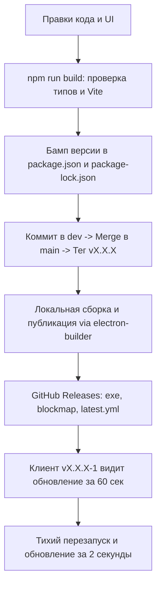

# Регламент релиза и обновления Exilium Switch

> Данный документ является обязательной пошаговой инструкцией для AI-агентов и разработчиков при выпуске новых версий приложения **Exilium Switch**.

---

## 1. Архитектура и структура версионирования

### Ветвление в Git
* **`dev`** — основная рабочая ветка для разработки, фиксов и тестирования. Все изменения сначала коммитятся сюда.
* **`main`** — релизная ветка. Код попадает сюда **только** через merge из `dev` при выпуске стабильной версии.
* **Теги (`vX.X.X`)** — выставляются на коммит в ветке `main` и инициируют создание релиза.

### Ключевые компоненты механизма обновлений
1. **`electron-updater`**: модуль внутри клиента, опрашивающий GitHub Releases каждые 60 секунд.
2. **`latest.yml`**: манифест с хешами sha512 и версией, по которому клиент понимает, что доступна новая версия.
3. **`.blockmap`**: файл дифференциального обновления. Позволяет скачивать не 110 МБ заново, а только изменившиеся блоки (дельта).
4. **Хук `afterPack` (`scripts/after-pack.cjs`)**:
   * Вшивает `app-update.yml` в `resources/`.
   * Патчит `Exilium Switch.exe` через `rcedit` (иконка Nostro, манифест `highestAvailable`, метаданные версии).



---

## 2. Пошаговый регламент: "Выпускаем новую версию"

Когда поступила команда выпустить обновление, последовательно выполняются **6 шагов**:

### Шаг 1. Локальная верификация сборки
Перед любыми коммитами убедиться, что код компилируется без ошибок TypeScript и Vite:
```powershell
npm run build
```
*(Код завершения должен быть 0).*

### Шаг 2. Поднятие версии (SemVer)
1. В файле [`package.json`](file:///e:/Code/ExiliumSwitch/package.json) изменить поле `"version"` (например, `1.4.2` $\to$ `1.4.3`).
2. Синхронизировать `package-lock.json`:
```powershell
npm install --package-lock-only
```

### Шаг 3. Фиксация в Git (dev $\to$ main $\to$ tag)
Сделать коммит в `dev`, смерджить в `main` и проставить тег с флагом `[skip ci]`, чтобы не создавать лишнюю очередь в облачных раннерах:
```powershell
# 1. Коммит в dev
git add .
git commit -m "feat: release v1.4.3 - описание изменений [skip ci]"
git push origin dev

# 2. Мердж в main
git checkout main
git merge dev
git push origin main

# 3. Создание и отправка тега
git tag v1.4.3
git push origin v1.4.3

# 4. Возврат в dev для дальнейшей работы
git checkout dev
```

### Шаг 4. Локальная сборка и прямая публикация на GitHub
> **Важно:** Облачные Windows-раннеры GitHub Actions на бесплатном тарифе часто простаивают в очереди по 10–15 минут («Waiting for a runner to pick up this job»). Поэтому мы публикуем релиз **напрямую с локального ПК** через токен GitHub, сохраненный в Windows Credential Manager. Сборка и заливка занимают всего ~30 секунд!

Скрипт публикации:
```python
import subprocess
import os
import sys

# 1. Извлечение токена GitHub из Windows Credential Manager
p = subprocess.Popen(["git", "credential", "fill"], stdin=subprocess.PIPE, stdout=subprocess.PIPE, stderr=subprocess.PIPE, text=True)
out, _ = p.communicate(input="protocol=https\nhost=github.com\n\n")
token = [l.split("=", 1)[1] for l in out.splitlines() if l.startswith("password=")][0]

env = os.environ.copy()
env["GH_TOKEN"] = token

# 2. Сборка Vite и Electron
print("Building frontend and electron main...")
res_build = subprocess.run(["npm.cmd", "run", "build"], cwd=r"e:\Code\ExiliumSwitch", env=env)
if res_build.returncode != 0:
    sys.exit(res_build.returncode)

# 3. Упаковка NSIS, Portable, генерация blockmap и заливка в GitHub Releases
print("Packaging and publishing to GitHub via electron-builder...")
res_pub = subprocess.run(["npx.cmd", "electron-builder", "--win", "--publish", "always"], cwd=r"e:\Code\ExiliumSwitch", env=env)
if res_pub.returncode != 0:
    sys.exit(res_pub.returncode)

print("SUCCESS: RELEASE PUBLISHED TO GITHUB!")
```

### Шаг 5. Верификация артефактов на GitHub Releases
Убедиться, что в релизе присутствуют все 4 обязательных файла:
* `Exilium-Switch-Setup-X.X.X.exe` (установщик NSIS One-Click).
* `Exilium-Switch-Setup-X.X.X.exe.blockmap` (блокмап для дельта-обновлений).
* `latest.yml` (манифест с sha512 хешами для electron-updater).
* `Exilium-Switch-Portable.exe` (портативная версия).

### Шаг 6. Проверка работы апдейтера в приложении
1. В запущенном клиенте предыдущей версии:
   * Дождаться системного уведомления Windows (интервал проверки — 60 секунд).
   * Либо нажать на версию `vX.X.X` в левом верхнем углу интерфейса.
2. В появившемся окне нажать **«Обновить»** $\to$ дождаться 100% $\to$ нажать **«Перезапустить сейчас»**.
3. Клиент закрывается, бесшумно заменяет обновленные файлы и перезапускается в новой версии за 2 секунды.

---

## 3. Критически важные технические нюансы (Gotchas)

| Нюанс / Настройка | Почему именно так (Причина) | Что произойдет, если нарушить |
| :--- | :--- | :--- |
| **`signAndEditExecutable: false`** в [`electron-builder.yml`](file:///e:/Code/ExiliumSwitch/electron-builder.yml) | В Windows встроенный инструмент `winCodeSign` падает при распаковке 7zip из-за darwin-симлинков. | Сборщик упадет с ошибкой `Cannot create symbolic link libcrypto.dylib`. |
| **Хук `afterPack: scripts/after-pack.cjs`** | Поскольку `signAndEditExecutable: false`, electron-builder не трогает `.exe`. Хук запускает `rcedit-x64.exe` вручную и вшивает иконку Nostro + метаданные до сборки инсталлятора. | На рабочем столе и в панели задач появится дефолтная сине-белая иконка Electron. |
| **`oneClick: true` + `differentialPackage: true`** в NSIS | Только при `oneClick: true` работает фоновое тихое дифференциальное обновление без показа окон мастера установки. | Поверх экрана пользователя вылезет классический мастер установки с кнопками «Далее». |
| **Запрет `allowToChangeInstallationDirectory: true`** при `oneClick: true` | NSIS и electron-builder считают эти параметры взаимоисключающими. | Сборка упадет с ошибкой `allowToChangeInstallationDirectory makes sense only for assisted installer`. |
| **Никаких кастомных полей в JSON sing-box** | Декодер ядра sing-box на Go написан с `DisallowUnknownFields()`. Метаданные (имена профилей) хранятся строго в [`profiles_meta.json`](file:///C:/Users/Nostro/AppData/Roaming/Exilium%20Switch/profiles/profiles_meta.json). | Ядро упадет с фатальной ошибкой `FATAL decode config: unknown field "_profileName"`. |
| **Real-IP Split DNS вместо FakeIP** | FakeIP (`198.18.0.0/15`) ломает голосовые сокеты Discord WebRTC (STUN/ICE), локальный софт (RMS, 1С) и системный резолвер Windows. | В Discord зависнет «RTC Connecting», а корпоративные сервисы заблокируют иностранный IP. |
| **Исключение inline `<style>` в `index.html`** | Rollup/Vite плагин `html-inline-proxy` конфликтует с параллельной сборкой Electron в `vite-plugin-electron`. | Ошибка `Could not load index.html?html-proxy&inline-css`. Все стили держим в `src/index.css`. |

---

## 4. Памятка по дизайну обновлений (Design System)
Все компоненты окна обновлений ([`UpdateModal.tsx`](file:///e:/Code/ExiliumSwitch/src/components/UpdateModal.tsx)) и общие диалоги строго следуют стилю **Fluent Dark Monochrome**:
* **Фон:** глубокий черный `#0e0e11`, шапка `#141418`.
* **Границы:** тонкие `border-white/10` или `border-white/15`.
* **Акцентные кнопки:** `bg-white text-black font-semibold hover:bg-zinc-200 active:scale-[0.98]`.
* **Второстепенные кнопки:** `bg-white/[0.06] hover:bg-white/10 text-zinc-300 border border-white/10`.
* **Прогресс-бар:** трек `bg-white/10`, заполнение `bg-white drop-shadow-[0_0_8px_rgba(255,255,255,0.7)]`.
* **Клик вне окна (Backdrop):** все модальные окна обязаны иметь `onClick={onClose}` на подложке и `e.stopPropagation()` на внутреннем блоке.
