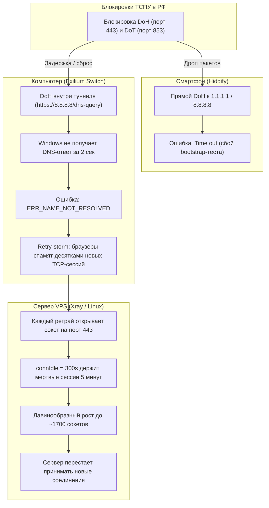

# Сводка изменений и оптимизаций VPN-инфраструктуры (26.08.2026)

## 1. Контекст инцидента и первопричины

Утром 26.08.2026 произошел масштабный сбой подключения:
- **На ПК:** Ошибка `ERR_NAME_NOT_RESOLVED` во всех браузерах при открытии любых зарубежных сайтов.
- **На телефонах (Hiddify):** Постоянный `Time out` при попытке подключения.
- **На сервере VPS:** Всплеск до **~1700 открытых сокетов** в панели 3X-UI, приведший к исчерпанию лимитов соединений.

---

## 2. Сводка примененных изменений

### А. Сервер VPS (`89.124.94.246`, Нидерланды, Ubuntu 22.04 LTS)

| Компонент / Файл | Что изменено | Технические параметры | Назначение |
| :--- | :--- | :--- | :--- |
| **/etc/sysctl.d/99-vless-tuning.conf** | Тюнинг сетевого стека ядра Linux | `net.core.somaxconn = 32768` `net.ipv4.ip_local_port_range = 10240 65535` `net.ipv4.tcp_max_syn_backlog = 16384` `net.ipv4.tcp_fin_timeout = 15` `net.ipv4.tcp_tw_reuse = 1` | Расширение пула портов до 55 000 (в 2 раза), увеличение очереди подключений в 8 раз, мгновенная переработка сокетов в состоянии `TIME_WAIT`. |
| **/usr/local/x-ui/bin/config.json** | Политика таймаутов Xray | `policy.levels.0.connIdle = 60` `policy.levels.0.handshake = 4` `policy.levels.0.uplinkOnly = 2` `policy.levels.0.downlinkOnly = 5` | Сброс зависших и неактивных TCP-сессий через **60 секунд** вместо 300 секунд (5 минут). Полностью устраняет накопление сокетов при штормах запросов. |
| **/usr/local/x-ui/bin/config.json** и **/etc/x-ui/x-ui.db** | Sniffing (распознавание протоколов) | `sniffing.enabled = true` `destOverride = ["http", "tls", "quic"]` `routeOnly = false` | Xray на сервере перехватывает и валидирует доменные имена внутри соединений, что необходимо для поддержки FakeIP. |
| **Fail2ban** | Активная фильтрация | Активны джейлы `sshd` и `3x-ipl` | Автоматическая блокировка IP-адресов ботов-сканеров через `iptables`. |
| **UFW (Файрвол)** | Оставлен в статусе `inactive` | `Status: inactive` | Исключен риск изоляции сервера, падения сети Docker (`docker0`) и нарушения Path MTU Discovery. |
| **Резервная копия БД** | Создан бэкап базы | `/etc/x-ui/x-ui.db.bak_*` | Сохранено исходное состояние настроек 3X-UI. |

---

### Б. Клиентская часть ПК ([ExiliumSwitch](file:///e:/Code/ExiliumSwitch/Configs))

Создана директория `Configs/` с двумя оптимизированными профилями:
- [nostro_config.json](file:///e:/Code/ExiliumSwitch/Configs/nostro_config.json) — основной ПК (UUID `2ae02656-034b-4868-acbe-9ead1de7ce6c`)
- [nono_config.json](file:///e:/Code/ExiliumSwitch/Configs/nono_config.json) — второй ПК (персональный UUID `ce4bd62c-42e4-46d7-90d5-6598bb7c99d5`)

#### Сравнение конфигураций: «Было» vs «Стало»

| Параметр конфига | Было (Старый `config.json`) | Стало (`Configs/nostro_config.json`) | Технический выигрыш |
| :--- | :--- | :--- | :--- |
| **Удаленный DNS** | `type: "https"`, `server: "8.8.8.8"`, `path: "/dns-query"` | `type: "udp"`, `server: "8.8.8.8"`, `server_port: 53` через `proxy-out` | Устранен тяжелый TLS-оверхед DoH. Внутри туннеля UDP-запрос зашифрован, невидим для ТСПУ и обрабатывается VPS за 0.35 мс. |
| **Резервный DNS** | Отсутствовал | Добавлен `udp://1.1.1.1:53` через `proxy-out` | Автоматическое переключение на Cloudflare при сбое Google DNS. |
| **Архитектура FakeIP** | Не использовалась | Добавлен резолвер `type: "fakeip"`, пул `198.18.0.0/15` | Ответ на DNS-запросы выдается из памяти ПК за **0.1 мс**. Ошибка `ERR_NAME_NOT_RESOLVED` исключена физически. |
| **Прямой DNS РФ** | Одиночный `77.88.8.8:53` | Основной `77.88.8.8:53` + резервный `77.88.8.1:53` | Отказоустойчивость для прямого российского сегмента. |
| **Сплит-список сайтов** | Базовый | Расширен: `.ru`, `.su`, `.рф`, Ozon, Wildberries, 2GIS, Кинопоиск, Яндекс, VK, Госуслуги, Сбербанк, Т-Банк, Альфа-Банк, ВТБ | Российские сервисы работают на максимальной скорости домашнего провайдера без VPN. |
| **Маршрутизация sing-box** | `action: "resolve"` | `action: "hijack-dns"` + `default_domain_resolver: "dns-direct"` | Полная совместимость со спецификацией ядра `sing-box 1.14`. |

---

### В. Мобильные клиенты (Hiddify на iOS / Android)

| Настройка | Прежнее значение | Установленное значение | Причина изменения |
| :--- | :--- | :--- | :--- |
| **Прямой DNS (Direct DNS)** | DoH Cloudflare / Google (`https://...`) | **`System`** (или `77.88.8.8`) | Операторы РФ блокируют DoH/DoT. Прямой системный DNS или чистый UDP 53 не блокируется, устраняя ошибку `Time out`. |
| **Удаленный DNS (Remote DNS)** | DoH Cloudflare | **`8.8.8.8`** (или `fakeip`) | Резолвинг через туннель без оверхеда. |
| **Обход LAN (Bypass LAN)** | Выключено / Не настроено | **Включено** | Прямой доступ к домашнему роутеру (`192.168.1.1`), принтерам, умному дому (Яндекс Станция) и AirPlay мимо VPN. |
| **Блокировать рекламу** | Выключено | **Включено** | Встроенный DNS-фильтр (AdGuard), вырезающий баннеры и мобильную видеорекламу. |
| **Маршрутизация** | Стандарт | **Обходить Россию (Bypass RU)** | Российские приложения открываются напрямую. |

---

## 3. Контрольные замеры после применения (26.08.2026)

- **Нагрузка на VPS (CPU Load):** `0.00, 0.00, 0.00`
- **Оперативная память:** `247 MiB` занято из `957 MiB` (свободно `564 MiB`, Swap `1 MiB`)
- **Количество активных соединений на порту 443:** **67 ESTABLISHED** (вместо 1700 утренних)
- **Сетевой отклик (Ping с VPS):**
  - Google DNS (`8.8.8.8`): **0.35 мс** (0% packet loss)
  - Cloudflare DNS (`1.1.1.1`): **0.82 мс** (0% packet loss)
  - Яндекс DNS (`77.88.8.8`): **47.9 мс** (0% packet loss)
- **Ошибки в системном журнале Xray (`journalctl`):** **0 ошибок**.

---

## 4. Дорожная карта дальнейших фундаментальных улучшений

1. **Hysteria 2 (QUIC / UDP):**
   - Добавление второго инбаунда в 3X-UI на отдельном UDP-порту.
   - Дает колоссальный прирост стабильности на смартфонах при потерях пакетов (до 15–20%) в метро и в дороге.
2. **Cloudflare CDN Fallback (VLESS-WS-CDN):**
   - Запасной канал «последней надежды» на случай прямой блокировки IP-адреса VPS (`89.124.94.246`) Роскомнадзором.
3. **Smart Auto-Failover (Автопереключение каналов):**
   - Конфигурация группы `urltest` / `fallback` в `sing-box` и Hiddify для прозрачного переключения между Reality и резервным транспортом за 100 мс без разрыва сессий.
